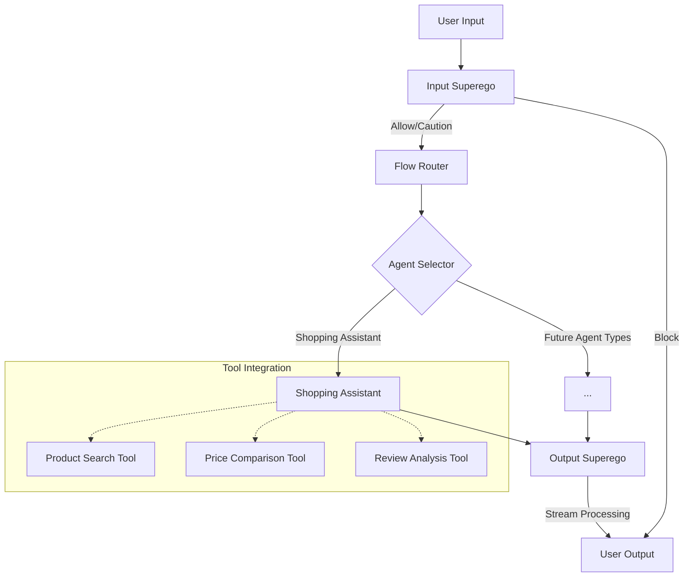
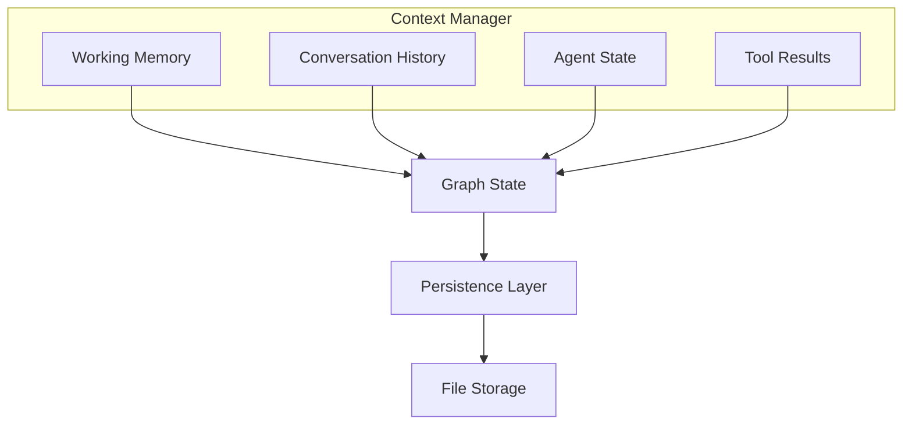
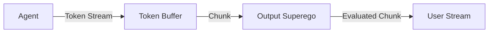

# Multi-Agent System Implementation Plan

## Architecture Overview

The new multi-agent architecture will replace the current flow system with a more robust, extensible framework that supports specialized agents, tool integration, and improved context management.

### High-Level Architecture



### Control Flow

The control flow will be implemented using LangGraph's `StateGraph` and `Command` objects:

1. **Entry Point**: User input enters the system and is first processed by the Input Superego.

2. **Input Superego Node**:
   - Evaluates user input against constitution
   - Returns a `Command` object with routing decision:
     - If BLOCK: Route directly to user output
     - If ALLOW/CAUTION: Route to the Flow Router

3. **Flow Router Node**:
   - Determines which agent type is needed based on:
     - User input content
     - Conversation history
     - Flow configuration
   - Returns a `Command` object with the selected agent

4. **Agent Nodes** (Shopping Assistant initially):
   - Process the input using specialized knowledge
   - Access relevant tools as needed
   - Generate a response
   - Return a `Command` object routing to Output Superego

5. **Output Superego Node**:
   - Receives streaming tokens from the agent
   - Evaluates each chunk against constitution
   - Allows/blocks/modifies content in real-time
   - Streams approved content to user

### Context Management



1. **Context Manager**:
   - Central component for managing all state
   - Provides different memory types:
     - **Working Memory**: Current conversation turn
     - **Conversation History**: Previous messages
     - **Agent State**: Agent-specific information
     - **Tool Results**: Results from tool calls

2. **State Passing**:
   - Each node receives the full context but can access only what it needs
   - Nodes update specific parts of the context
   - Context is passed through `Command` objects

3. **Persistence**:
   - All state is automatically persisted to file storage
   - Flow instances maintain their state across server restarts
   - Conversation history is preserved

### Streaming Implementation



1. **Token Streaming**:
   - Agent generates tokens and streams them to a buffer
   - Buffer collects tokens into meaningful chunks
   - Chunks are sent to Output Superego for evaluation

2. **Output Superego Processing**:
   - Receives chunks in real-time
   - Evaluates each chunk against constitution
   - Makes decisions:
     - ALLOW: Pass chunk through unchanged
     - MODIFY: Edit chunk content
     - BLOCK: Replace chunk with explanation

3. **Progressive Processing**:
   - Output Superego maintains context of previous chunks
   - Evaluates new chunks in context of previous ones
   - Can retroactively modify response if later chunks change context

### New File Structure

```
backend/app/
├── agents/
│   ├── __init__.py
│   ├── base.py             # Base agent class
│   ├── input_superego.py   # Input evaluation agent
│   ├── output_superego.py  # Output evaluation agent
│   ├── shopping.py         # Shopping assistant agent
│   └── factory.py          # Agent factory
├── tools/
│   ├── __init__.py
│   ├── registry.py         # Tool registry
│   ├── product_search.py   # Product search tool
│   ├── price_compare.py    # Price comparison tool
│   └── review_analysis.py  # Review analysis tool
├── context/
│   ├── __init__.py
│   ├── manager.py          # Context manager
│   ├── memory.py           # Memory implementations
│   └── persistence.py      # Persistence layer
├── flow/
│   ├── __init__.py
│   ├── graph.py            # LangGraph implementation
│   ├── router.py           # Flow router
│   ├── nodes.py            # Graph nodes
│   └── streaming.py        # Streaming implementation
├── models.py               # Data models
└── api/                    # API endpoints
```

## Implementation Phases

### Phase 1: Core Structure and Models
- [ ] Create new directory structure
- [ ] Update models.py with new data models
- [ ] Implement base agent class
- [ ] Create context manager foundation

### Phase 2: Input Superego and Flow Router
- [ ] Implement Input Superego agent
- [ ] Create Flow Router node
- [ ] Set up basic LangGraph structure
- [ ] Implement agent selection logic

### Phase 3: Shopping Assistant and Tools
- [ ] Implement Shopping Assistant agent
- [ ] Create tool registry
- [ ] Implement shopping-related tools
- [ ] Connect agent to tools

### Phase 4: Output Superego and Streaming
- [ ] Implement Output Superego agent
- [ ] Create streaming buffer
- [ ] Implement chunk evaluation
- [ ] Set up progressive processing

### Phase 5: Context Management and Persistence
- [ ] Implement different memory types
- [ ] Create persistence layer
- [ ] Connect context manager to graph state
- [ ] Ensure state preservation across restarts

### Phase 6: API Integration and Testing
- [ ] Update API endpoints
- [ ] Implement WebSocket handlers
- [ ] Create test suite
- [ ] Perform integration testing

## Progress Tracking

### Completed
- Initial architecture design
- Implementation plan

### In Progress
- Setting up new directory structure

### Up Next
- Creating new data models
- Implementing base agent class

## Frontend Integration Guide

This section will be updated as implementation progresses to provide guidance for frontend engineers.

### API Changes

#### New Endpoints
- TBD

#### Modified Endpoints
- TBD

#### WebSocket Events
- TBD

### Data Models

#### New Models
- TBD

#### Modified Models
- TBD

### UI Considerations

#### Agent Selection
- TBD

#### Tool Visualization
- TBD

#### Streaming Display
- TBD

## Notes and Considerations

- The implementation will maintain backward compatibility where possible
- All changes will be documented in this file
- Frontend integration details will be updated as implementation progresses
