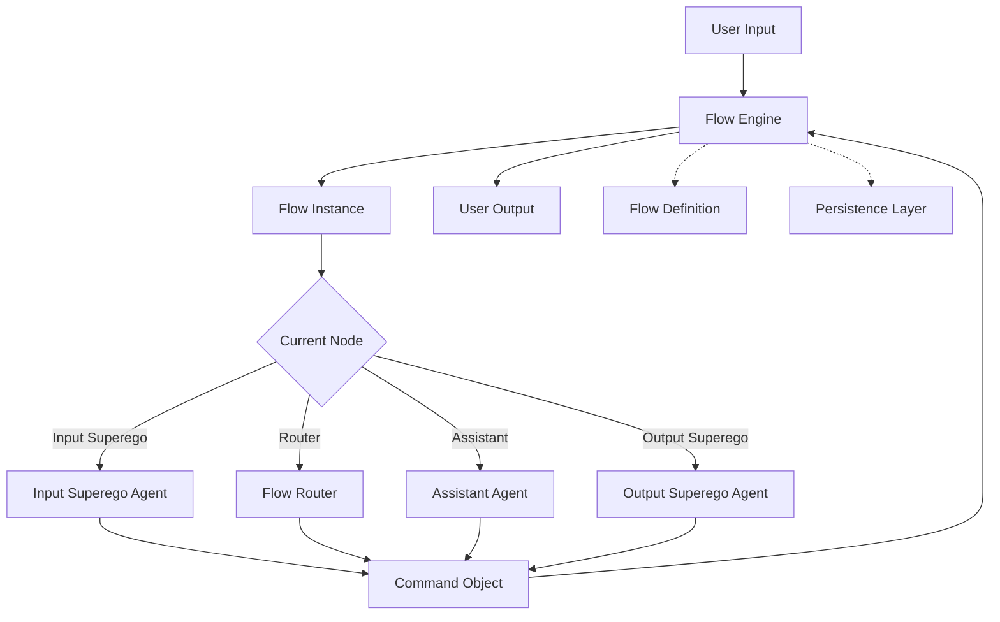

# Multi-Agent System Implementation Plan (Revised)

## Current System Analysis

The current system has several issues:

1. **Fragmented State Management**:
   - Flow instances are managed separately from message stores
   - There's a redundant `message_store_id` field in flow instances
   - No clear way to track agent state or tool usage

2. **Limited Flow Definition**:
   - Current flows are hardcoded with just input superego and autogen agent
   - No support for specialized agents or complex routing

3. **Inefficient Persistence**:
   - Multiple JSON files for related data (flow instances, messages)
   - No automatic state preservation

## What We've Done So Far

1. **Agent Base Classes** (`agents/base.py` and `agents/__init__.py`):
   - Created abstract base classes for different agent types
   - Defined common interfaces and methods
   - Implemented base classes for superego and assistant agents
   - Added new agent types (ROUTER, RESEARCHER)

2. **Updated Models** (`models.py`):
   - Added new models for flow definitions and instances
   - Added models for node configurations and edges
   - Added models for tool usage and node execution records
   - Added flow status enum and WebSocket message types
   - Removed redundant message_store_id field from FlowInstance

3. **Flow Engine** (`flow_engine.py`):
   - Implemented central component for managing flow execution
   - Added support for loading/saving flow definitions and instances as individual files
   - Implemented LangGraph integration for flow execution
   - Added support for streaming and callbacks

4. **Initialization Script** (`init_flow_system.py`):
   - Created script to initialize the flow system
   - Sets up flow definitions and instances directories
   - Creates default flow definitions
   - Creates a research flow definition with multiple agents

5. **Frontend Integration Guide** (`frontend_integration_guide.md`):
   - Documented changes needed in the frontend
   - Provided examples of new WebSocket message types
   - Outlined new API endpoints
   - Suggested UI components and state management
   - Included migration strategy for frontend developers

## What We've Removed

1. **Context Management** (`context/` directory):
   - Removed the separate context management system
   - Integrated context directly into flow instances

2. **Message Store**:
   - Removed the separate message store
   - Messages are now stored directly in flow instances

## New Architecture Overview



## Key Components

### 1. Flow Definition

A blueprint that defines what a flow does:
- Specifies which agents are in the flow (input superego, assistants, etc.)
- Defines how agents connect to each other (the routing logic)
- Stored in a central registry

Example:
```json
{
  "flow_id": "research_flow",
  "nodes": {
    "input_superego": { "type": "superego", "config": {...} },
    "router": { "type": "router", "config": {...} },
    "researcher": { "type": "assistant", "config": {...} },
    "output_superego": { "type": "superego", "config": {...} }
  },
  "edges": [
    {"from": "START", "to": "input_superego"},
    {"from": "input_superego", "to": "router", "condition": "ALLOW"},
    {"from": "input_superego", "to": "END", "condition": "BLOCK"},
    {"from": "router", "to": "researcher"},
    {"from": "researcher", "to": "output_superego"},
    {"from": "output_superego", "to": "END"}
  ]
}
```

### 2. Flow Instance

A running instance of a flow definition:
- Has its own unique ID
- Maintains its current state (which agent is active)
- Stores all messages and interactions that have happened
- Persists across server restarts

Example:
```json
{
  "instance_id": "abc123",
  "flow_id": "research_flow",
  "current_node": "researcher",
  "status": "running",
  "history": [
    {
      "node": "input_superego",
      "input": "How do I make a bomb?",
      "output": {
        "decision": "BLOCK",
        "reason": "This request could potentially be harmful..."
      },
      "timestamp": "2025-03-09T16:30:00Z"
    }
  ],
  "messages": [
    {
      "id": "msg1",
      "role": "user",
      "content": "How do I make a bomb?",
      "timestamp": "2025-03-09T16:29:55Z"
    },
    {
      "id": "msg2",
      "role": "superego",
      "content": "This request could potentially be harmful...",
      "decision": "BLOCK",
      "timestamp": "2025-03-09T16:30:00Z"
    }
  ],
  "agent_states": {
    "researcher": {
      "tools_used": ["search", "summarize"],
      "context": {...}
    }
  },
  "tool_results": [
    {
      "tool": "search",
      "input": {"query": "..."},
      "output": {...},
      "timestamp": "2025-03-09T16:31:00Z"
    }
  ]
}
```

### 3. Flow Engine

The system that runs flows:
- Creates instances from definitions
- Routes messages between agents
- Tracks state changes
- Handles persistence

### 4. Command Object

Used for routing between agents:
- Specifies which agent to call next
- Includes state updates
- Can include conditions

Example:
```python
Command(
    goto="researcher",
    update={"current_query": "research topic"},
    condition="ALLOW"
)
```

## Implementation Plan

### Phase 1: Core Models and Flow Engine

1. **Update Flow Instance Model**:
   - Add fields for messages, agent states, and tool results
   - Remove redundant message_store_id field
   - Add current_node and status fields

2. **Create Flow Definition Model**:
   - Define structure for nodes and edges
   - Support for different agent types and configurations
   - Support for conditional routing

3. **Implement Flow Engine**:
   - Create a central component for managing flow execution
   - Handle routing between agents
   - Manage state persistence

### Phase 2: Agent Integration

1. **Update Agent Interface**:
   - Ensure agents can work with the flow engine
   - Standardize input/output formats
   - Support for Command objects

2. **Implement Specialized Agents**:
   - Router agent for directing flow
   - Output superego for evaluating responses
   - Specialized assistant agents (researcher, etc.)

### Phase 3: Persistence and Migration

1. **Implement Persistence Layer**:
   - Single file per flow instance
   - Automatic state snapshots
   - Efficient loading/saving

2. **Create Migration Script**:
   - Convert existing flow instances and messages
   - Update references in the codebase

### Phase 4: API and WebSocket Integration

1. **Update API Endpoints**:
   - Expose flow definitions and instances
   - Support for flow control (pause, resume, etc.)

2. **Update WebSocket Handlers**:
   - Real-time updates for flow state
   - Support for streaming responses

## Frontend Integration

The frontend will need to be updated to support the new multi-agent architecture:

1. **Flow Visualization**:
   - Display current active agent
   - Show flow progress
   - Visualize transitions between agents

2. **Agent-Specific UI**:
   - Different display for different agent types
   - Support for tool visualization
   - Specialized input methods if needed

3. **State Management**:
   - Track flow state on the client
   - Handle reconnection and state synchronization
   - Support for multiple parallel flows

## Next Steps

1. **Implement Specialized Agents**:
   - Create concrete implementations for the Router agent
   - Create concrete implementations for the Researcher agent
   - Register these agents with the AgentFactory

2. **Update API Endpoints**:
   - Create new endpoints for flow definitions
   - Update existing endpoints for flow instances
   - Add endpoints for flow control (pause, resume, etc.)

3. **Update WebSocket Handlers**:
   - Add handlers for new message types
   - Implement real-time updates for flow state
   - Support streaming from multiple agents

4. **Test the System**:
   - Create test cases for different flow scenarios
   - Test with complex multi-agent flows
   - Verify persistence and state management

## Handover Notes

This implementation plan outlines a complete overhaul of the flow system to support multi-agent architectures. The key points for anyone continuing this work:

1. **Keep the agent base classes** - They provide a solid foundation
2. **Replace the fragmented state management** - Flow instances should contain all state
3. **Use LangGraph for flow execution** - It provides the Command objects and routing we need
4. **Ensure backward compatibility** - Existing flows should still work with the new system

The most critical part is ensuring that flow instances contain all the state they need, eliminating the separate message store and making the system more robust and easier to understand.
