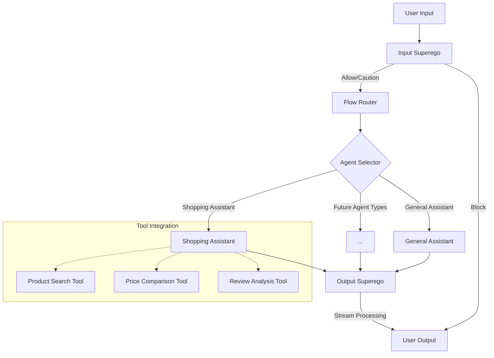

# Multi-Agent System Implementation Plan (Updated)

## Current System Analysis

The current system has a basic flow architecture with:

1. **InputSuperego Agent**: Evaluates user input against a constitution
2. **AutoGen Agent**: Processes allowed inputs and generates responses
3. **LangGraph Integration**: Simple two-node graph (superego → assistant)
4. **Flow Management**: Basic flow configuration and instance management

While this provides a foundation, it lacks the robust multi-agent architecture described in the requirements. The current implementation is limited to a single flow path and doesn't support specialized agents or tool integration.

## Architecture Overview

The updated multi-agent architecture will build on the existing code while implementing the requirements in the project_requirements.md file:



## Implementation Strategy

### 1. Reuse Existing Components

We'll reuse and extend these existing components:

- **Agent Factory**: Already supports agent registration and creation
- **LLM Client**: Handles communication with LLM APIs
- **Constitution Registry**: Manages constitutions for superego agents
- **Flow Manager**: Handles flow configurations and instances
- **Graph Implementation**: Basic LangGraph implementation

### 2. New Components to Implement

- **Agent Base Classes**: Create specialized base classes for different agent types
- **Tool Registry**: Implement a registry for tools that agents can use
- **Context Manager**: Develop a robust context management system
- **Flow Router**: Create a router node for directing flow between agents
- **Output Superego**: Implement an output evaluation agent with streaming support

### 3. Directory Structure

We'll maintain the existing directory structure while adding new directories for the multi-agent system:

```
backend/app/
├── agents/
│   ├── __init__.py
│   ├── base.py             # Base agent classes
│   ├── input_superego.py   # Input evaluation agent
│   ├── output_superego.py  # Output evaluation agent
│   ├── shopping.py         # Shopping assistant agent
│   ├── general.py          # General assistant agent
│   └── factory.py          # Enhanced agent factory
├── tools/
│   ├── __init__.py
│   ├── registry.py         # Tool registry
│   ├── product_search.py   # Product search tool
│   ├── price_compare.py    # Price comparison tool
│   └── review_analysis.py  # Review analysis tool
├── context/
│   ├── __init__.py
│   ├── manager.py          # Context manager
│   ├── memory.py           # Memory implementations
│   └── persistence.py      # Persistence layer
├── flow/
│   ├── __init__.py
│   ├── graph.py            # Enhanced LangGraph implementation
│   ├── router.py           # Flow router
│   ├── nodes.py            # Graph nodes
│   └── streaming.py        # Streaming implementation
```

## Implementation Phases

### Phase 1: Core Structure and Base Classes

1. **Create Agent Base Classes**
   - Implement `BaseAgent` abstract class
   - Create specialized base classes for different agent types:
     - `SuperegoAgent` for evaluation agents
     - `AssistantAgent` for task-specific agents
     - `ToolUsingAgent` for agents that use tools

2. **Implement Context Manager**
   - Create `ContextManager` class for managing different types of memory
   - Implement persistence layer for saving and loading context
   - Connect context manager to graph state

### Phase 2: Enhanced LangGraph Implementation

1. **Implement Flow Router**
   - Create `FlowRouter` node for directing flow between agents
   - Implement agent selection logic based on input content and context

2. **Update Graph Implementation**
   - Enhance the existing graph.py to support the new multi-agent architecture
   - Implement `Command` objects for routing between agents
   - Add support for subgraphs and hierarchical routing

### Phase 3: Agent Implementations

1. **Update Input Superego**
   - Enhance the existing InputSuperego agent to work with the new architecture
   - Implement improved evaluation logic

2. **Implement Output Superego**
   - Create OutputSuperego agent for evaluating streaming responses
   - Implement chunk evaluation and progressive processing

3. **Implement Specialized Agents**
   - Create ShoppingAssistant agent
   - Update the existing AutoGen agent to be a GeneralAssistant

### Phase 4: Tool Integration

1. **Implement Tool Registry**
   - Create a registry for tools that agents can use
   - Implement tool registration and discovery

2. **Create Shopping Tools**
   - Implement ProductSearch tool
   - Implement PriceComparison tool
   - Implement ReviewAnalysis tool

3. **Connect Tools to Agents**
   - Update ShoppingAssistant to use the shopping tools
   - Implement tool usage tracking in context

### Phase 5: API and WebSocket Integration

1. **Update API Endpoints**
   - Update existing endpoints to work with the new architecture
   - Add new endpoints for tool management

2. **Update WebSocket Handlers**
   - Enhance WebSocket handlers to support the new message types
   - Implement streaming for output superego evaluation

## Detailed Implementation Plan

### Phase 1: Core Structure and Base Classes

#### Task 1.1: Create Agent Base Classes

1. Create `agents/base.py` with:
   - Abstract `BaseAgent` class
   - `SuperegoAgent` base class
   - `AssistantAgent` base class
   - `ToolUsingAgent` base class

2. Define common interfaces and methods:
   - `process()` for processing inputs
   - `stream()` for streaming responses
   - `interrupt()` for interrupting processing
   - `evaluate()` for superego agents

#### Task 1.2: Implement Context Manager

1. Create `context/manager.py` with:
   - `ContextManager` class
   - Methods for managing different types of memory
   - State persistence and retrieval

2. Create `context/memory.py` with:
   - `WorkingMemory` class for current conversation turn
   - `ConversationHistory` class for previous messages
   - `AgentState` class for agent-specific information
   - `ToolResults` class for results from tool calls

### Phase 2: Enhanced LangGraph Implementation

#### Task 2.1: Implement Flow Router

1. Create `flow/router.py` with:
   - `FlowRouter` class for directing flow between agents
   - Agent selection logic based on input content and context
   - Routing decision methods

#### Task 2.2: Update Graph Implementation

1. Update `flow/graph.py` with:
   - Enhanced graph structure for multi-agent routing
   - Support for `Command` objects
   - Subgraph and hierarchical routing support

2. Create `flow/nodes.py` with:
   - `InputSuperego` node
   - `FlowRouter` node
   - `AgentSelector` node
   - `OutputSuperego` node

### Phase 3: Agent Implementations

#### Task 3.1: Update Input Superego

1. Create `agents/input_superego.py` with:
   - Enhanced `InputSuperego` class
   - Improved evaluation logic
   - Integration with context manager

#### Task 3.2: Implement Output Superego

1. Create `agents/output_superego.py` with:
   - `OutputSuperego` class
   - Chunk evaluation methods
   - Progressive processing logic

#### Task 3.3: Implement Specialized Agents

1. Create `agents/shopping.py` with:
   - `ShoppingAssistant` class
   - Product recommendation logic
   - Tool usage integration

2. Create `agents/general.py` with:
   - `GeneralAssistant` class based on existing AutoGen agent
   - Enhanced processing capabilities

### Phase 4: Tool Integration

#### Task 4.1: Implement Tool Registry

1. Create `tools/registry.py` with:
   - `ToolRegistry` class
   - Tool registration methods
   - Tool discovery and retrieval

#### Task 4.2: Create Shopping Tools

1. Create `tools/product_search.py` with:
   - `ProductSearch` tool class
   - Search implementation

2. Create `tools/price_compare.py` with:
   - `PriceComparison` tool class
   - Comparison implementation

3. Create `tools/review_analysis.py` with:
   - `ReviewAnalysis` tool class
   - Analysis implementation

### Phase 5: API and WebSocket Integration

#### Task 5.1: Update API Endpoints

1. Update existing API endpoints to work with the new architecture
2. Add new endpoints for tool management

#### Task 5.2: Update WebSocket Handlers

1. Enhance WebSocket handlers to support the new message types
2. Implement streaming for output superego evaluation

## Frontend Integration Guide

### API Changes

#### New Endpoints

- `/api/tools` - Get available tools
- `/api/agents` - Get available agent types

#### Modified Endpoints

- `/api/conversations` - Updated to include agent and tool information
- `/api/flow_instances` - Updated to support multi-agent flows

#### WebSocket Events

- `tool_usage` - Sent when a tool is used by an agent
- `agent_selection` - Sent when an agent is selected for a task
- `output_evaluation` - Sent during output superego evaluation

### UI Considerations

#### Agent Selection

The frontend should provide a way for users to:
- View which agent is handling their request
- Optionally select a specific agent for their task

#### Tool Visualization

When tools are used, the frontend should:
- Display which tools are being used
- Show the results from tool operations
- Provide visual feedback during tool usage

#### Streaming Display

The frontend should support:
- Displaying streaming responses from agents
- Showing visual indicators for superego interventions
- Highlighting caution messages or blocked content

## Progress Tracking

This section will be updated as implementation progresses to track completed tasks and next steps.

### Completed
- Initial architecture design
- Implementation plan

### In Progress
- Setting up agent base classes

### Up Next
- Implementing context manager
- Enhancing LangGraph implementation

## Notes and Considerations

- The implementation will maintain backward compatibility where possible
- All changes will be documented in this file
- Frontend integration details will be updated as implementation progresses
