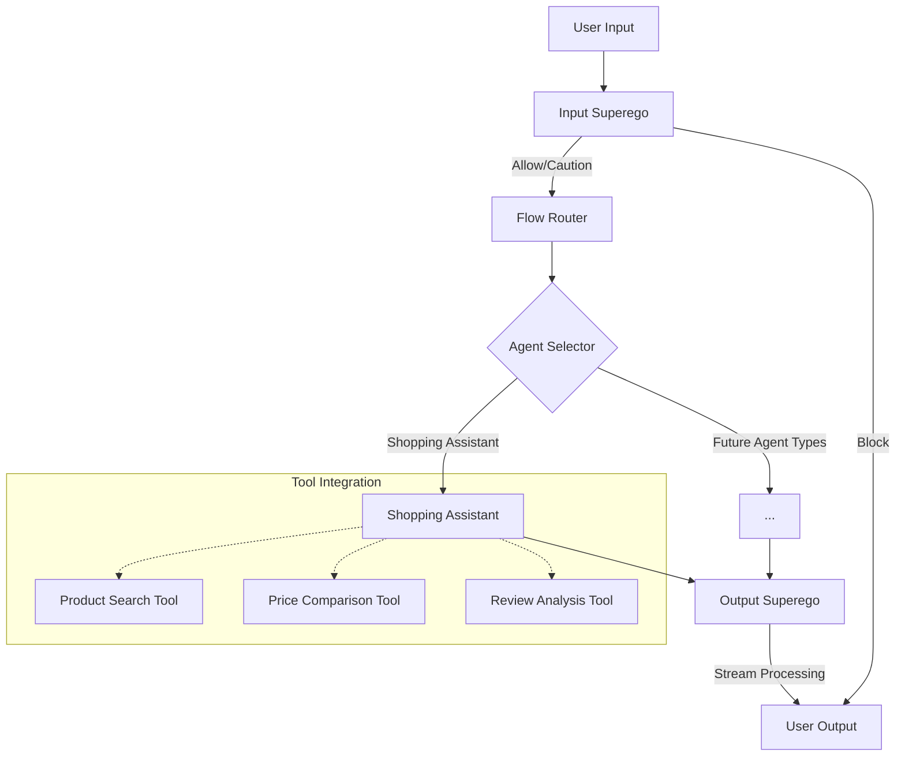
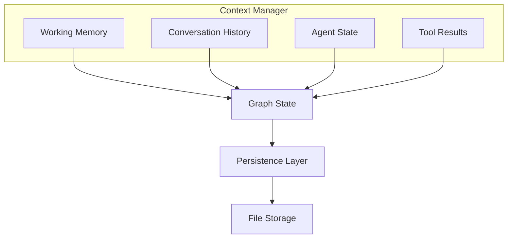
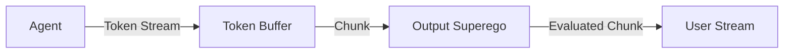

# Superego LangChain Project Requirements

## Overview

This document outlines the requirements and architectural decisions for the Superego LangChain project, focusing on the multi-agent system architecture and the superego functionality.

## System Requirements

### Core Requirements

1. **Multi-Agent Architecture**
   - Support for multiple specialized agents
   - Ability to route between agents based on input content and context
   - Extensible framework for adding new agent types

2. **Superego Functionality**
   - Input evaluation against constitutions/guidelines
   - Output evaluation with real-time streaming
   - Ability to block, caution, or allow content

3. **Control Flow**
   - Explicit control flow between agents
   - Ability for superego to modify context and insert messages
   - Support for blocking user input or agent output

4. **Context Management**
   - Robust context management across agents
   - Persistence of state across server restarts
   - Different types of memory (working, conversation history, etc.)

5. **Tool Integration**
   - Support for specialized tools for agents
   - Tool registry for managing available tools
   - Ability for agents to use tools and share results

6. **Streaming**
   - Token-by-token streaming from agents
   - Progressive evaluation of content by output superego
   - Real-time modification or blocking of content

### Specific Agent Requirements

1. **Input Superego Agent**
   - Evaluates user input against constitution
   - Makes decisions to block, caution, or allow
   - Provides reasoning for decisions

2. **Output Superego Agent**
   - Receives streaming tokens from other agents
   - Evaluates content in real-time
   - Can modify or block content before it reaches the user

3. **Shopping Assistant Agent** (Initial specialized agent)
   - Provides product recommendations
   - Uses specialized shopping tools
   - Generates responses that are evaluated by output superego

4. **Future Agent Types**
   - Framework must support easy addition of new agent types
   - Agents should be pluggable into the existing flow

## Architectural Decisions

### LangGraph for Control Flow

We've decided to use LangGraph for the overall control flow because:

1. **Explicit Graph Structure**: LangGraph provides a clear, explicit graph structure for routing between agents.
2. **State Management**: It has robust state management capabilities for passing context between nodes.
3. **Command Objects**: It supports Command objects for making routing decisions.
4. **Integration with Streaming**: It works well with streaming through its state management.

### AutoGen for Agent Implementations

We'll use AutoGen for implementing the actual agents because:

1. **Agent Framework**: AutoGen provides a robust framework for creating agents.
2. **Tool Usage**: It has good support for tool usage.
3. **Existing Implementations**: We can leverage existing AutoGen agents.
4. **Streaming Support**: It supports streaming responses.

### Hybrid Approach

Our architecture will use a hybrid approach:

1. LangGraph will handle the overall control flow, routing, and state management.
2. AutoGen will provide the actual agent implementations that do the work.
3. This gives us the structured control flow needed for superego functionality while allowing flexibility in agent implementations.

## Flow Architecture



## Context Management



## Streaming Implementation



## Implementation Structure

```
backend/app/
├── agents/
│   ├── __init__.py
│   ├── base.py             # Base agent class
│   ├── input_superego.py   # Input evaluation agent
│   ├── output_superego.py  # Output evaluation agent
│   ├── shopping.py         # Shopping assistant agent
│   └── factory.py          # Agent factory
├── tools/
│   ├── __init__.py
│   ├── registry.py         # Tool registry
│   ├── product_search.py   # Product search tool
│   ├── price_compare.py    # Price comparison tool
│   └── review_analysis.py  # Review analysis tool
├── context/
│   ├── __init__.py
│   ├── manager.py          # Context manager
│   ├── memory.py           # Memory implementations
│   └── persistence.py      # Persistence layer
├── flow/
│   ├── __init__.py
│   ├── graph.py            # LangGraph implementation
│   ├── router.py           # Flow router
│   ├── nodes.py            # Graph nodes
│   └── streaming.py        # Streaming implementation
├── models.py               # Data models
└── api/                    # API endpoints
```

## Implementation Phases

1. **Core Structure and Models**
   - Create new directory structure
   - Update models.py with new data models
   - Implement base agent class
   - Create context manager foundation

2. **Input Superego and Flow Router**
   - Implement Input Superego agent
   - Create Flow Router node
   - Set up basic LangGraph structure
   - Implement agent selection logic

3. **Shopping Assistant and Tools**
   - Implement Shopping Assistant agent
   - Create tool registry
   - Implement shopping-related tools
   - Connect agent to tools

4. **Output Superego and Streaming**
   - Implement Output Superego agent
   - Create streaming buffer
   - Implement chunk evaluation
   - Set up progressive processing

5. **Context Management and Persistence**
   - Implement different memory types
   - Create persistence layer
   - Connect context manager to graph state
   - Ensure state preservation across restarts

6. **API Integration and Testing**
   - Update API endpoints
   - Implement WebSocket handlers
   - Create test suite
   - Perform integration testing

## Frontend Integration Considerations

The frontend will need to be updated to support the new multi-agent architecture:

1. **Agent Selection UI**
   - Interface for selecting which agent to use
   - Display of available agent types

2. **Tool Visualization**
   - Display of tools being used by agents
   - Visualization of tool results

3. **Streaming Display**
   - Support for displaying streaming responses
   - Visual indicators for superego interventions
   - Display of caution messages

4. **Context Visualization**
   - Display of relevant context
   - History of agent interactions

## Persistence Requirements

1. **Flow Instances**
   - Persist flow instances to file storage
   - Maintain state across server restarts

2. **Conversation History**
   - Store complete conversation history
   - Include metadata about agent interactions

3. **Agent State**
   - Persist agent-specific state
   - Allow resuming agent operations

4. **Tool Results**
   - Store results from tool operations
   - Make available for future reference

## Next Steps

1. Complete the implementation plan with detailed tasks
2. Set up the core structure and models
3. Implement the Input Superego agent
4. Create the Flow Router
5. Develop the Shopping Assistant agent and tools
6. Implement the Output Superego with streaming
7. Build the context management system
8. Update the API and frontend integration
