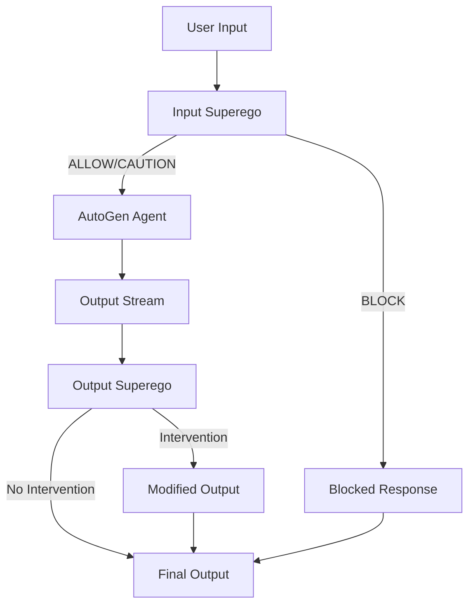

# Superego-LangChain Refactoring Plan - Incremental MVP Approach

## Project Context

The Superego-LangChain application is a system that implements a unique approach to AI safety and control through a "superego" concept. Here are the key aspects of the current system:

1. **Superego Agent**: A special type of agent responsible for checking the inputs, plans, and outputs of other models. The superego agent evaluates content against a set of rules (a "constitution") to ensure compliance with safety guidelines.

2. **Constitution System**: The superego operates based on a swappable set of rules called a "constitution." This allows for different evaluation criteria to be applied depending on the use case or requirements.

3. **Frontend as Thin Client**: The frontend is designed as a thin client that primarily controls the backend. It doesn't contain significant business logic and mainly serves as an interface for interacting with the backend services.

4. **Current Implementation Challenges**: The current implementation is entirely in LangGraph, which has proven to be somewhat clunky and buggy, taking up significant space in the codebase.

## Current System Architecture

The current system uses LangGraph for all agent interactions:
- User input is processed by a LangGraph-based superego agent
- If approved, the input is passed to a LangGraph-based assistant agent
- The system uses a complex state management approach with checkpoints
- The frontend communicates with the backend via WebSockets

## Refactoring Goals

The main goals of this refactoring are:

1. **Clean and Elegant Codebase**: Simplify the architecture and make it more maintainable.

2. **Multiple Superego Types**: Support different types of superego agents for different purposes.

3. **Real-time Monitoring**: Allow superego agents to monitor outputs of other agents as they stream.

4. **AutoGen Integration**: Use AutoGen to simplify agent implementation while maintaining the superego concept.

5. **Customizable Flows**: Create a system of simple, customizable flows where superego agents can be inserted to screen inputs and outputs.

## Incremental MVP Approach

To achieve these goals, we'll use an incremental MVP approach, building and testing one component at a time:

### MVP 1: Agent Abstraction & Basic AutoGen Integration

**Goal**: Create the foundational agent abstraction and integrate a basic AutoGen agent.

**Key Components**:
- Agent interface with `process()`, `stream()`, and `interrupt()` methods
- Basic AutoGen agent implementation
- Simple CLI test harness to verify functionality

**Testing Criteria**:
- Can create an AutoGen agent
- Can process basic queries and get responses
- Can stream responses token by token

### MVP 2: Input Superego Implementation

**Goal**: Implement a basic input-checking superego agent.

**Key Components**:
- Superego agent implementation that evaluates user inputs
- Basic constitution system (initially using existing JSON format)
- CLI enhancements to show superego evaluations

**Testing Criteria**:
- Superego can evaluate inputs against a constitution
- Can classify inputs as ALLOW/CAUTION/BLOCK
- CLI shows the evaluation results

### MVP 3: Constitution System Upgrade

**Goal**: Refactor the constitution system to use individual files.

**Key Components**:
- Constitution registry that loads from individual markdown files
- System prompt registry with similar functionality
- CLI commands to list and select constitutions

**Testing Criteria**:
- Can load constitutions from individual files
- Can switch between different constitutions
- Can add new constitutions without code changes

### MVP 4: Output Superego Implementation

**Goal**: Add real-time monitoring of agent outputs.

**Key Components**:
- Output superego that monitors token streams
- Basic intervention system (initially just flagging)
- Enhanced CLI to show interventions

**Testing Criteria**:
- Can monitor output streams in real-time
- Can detect potentially problematic content
- CLI shows when interventions occur

### MVP 5: Advanced Interventions

**Goal**: Implement more sophisticated intervention capabilities.

**Key Components**:
- Enhanced intervention system with modify/stop capabilities
- Intervention handling in the flow manager
- CLI enhancements to demonstrate different intervention types

**Testing Criteria**:
- Can modify outputs when issues are detected
- Can stop generation when serious issues are found
- CLI clearly shows the different intervention types

### MVP 6: Flow Architecture

**Goal**: Implement the complete flow architecture.

**Key Components**:
- Flow manager that orchestrates the entire process
- Support for different agent configurations
- CLI commands to switch between flows

**Testing Criteria**:
- Complete flow from input to output works correctly
- Can switch between different flow configurations
- All components work together seamlessly

### MVP 7: WebSocket Integration

**Goal**: Update the WebSocket endpoints to work with the new architecture.

**Key Components**:
- Updated WebSocket handlers
- Frontend compatibility layer
- Enhanced message types for new capabilities

**Testing Criteria**:
- WebSocket endpoints correctly handle all message types
- Frontend can connect and interact with the new backend
- Real-time streaming and interventions work over WebSockets

## Target Architecture

## Current Implementation Plan

We are currently working on **MVP 1: Agent Abstraction & Basic AutoGen Integration**. This involves:

### Files to Modify for MVP 1

1. **backend/app/agents.py**
   - Add Agent interface with `process()`, `stream()`, and `interrupt()` methods
   - Add AgentFactory class for creating different agent types
   - Implement basic AutoGenAgent class using pyautogen

2. **backend/requirements.txt**
   - Add AutoGen dependency

3. **backend/app/cli.py** (new file)
   - Create a simple CLI test harness for the AutoGen agent

### Implementation Steps for MVP 1

1. Update dependencies in requirements.txt
2. Implement the Agent interface in agents.py
3. Implement the AutoGenAgent class
4. Create a basic CLI test harness
5. Test the AutoGen agent with basic queries

## Testing Strategy for MVP 1

1. **Unit Tests**
   - Test the Agent interface implementation
   - Test the AutoGenAgent class with mock responses
   - Test the AgentFactory with different configurations

2. **Integration Tests**
   - Test the AutoGen agent with real API calls
   - Verify streaming functionality works correctly
   - Test with different system prompts

3. **CLI Testing**
   - Test the CLI interface with various inputs
   - Verify responses are displayed correctly
   - Test error handling and edge cases

## Next Steps After MVP 1

Once MVP 1 is complete and tested, we'll move on to MVP 2: Input Superego Implementation, which will involve:

1. Implementing the SuperegoAgent class
2. Integrating it with the existing constitution system
3. Enhancing the CLI to show superego evaluations
4. Testing the superego agent with different inputs and constitutions
